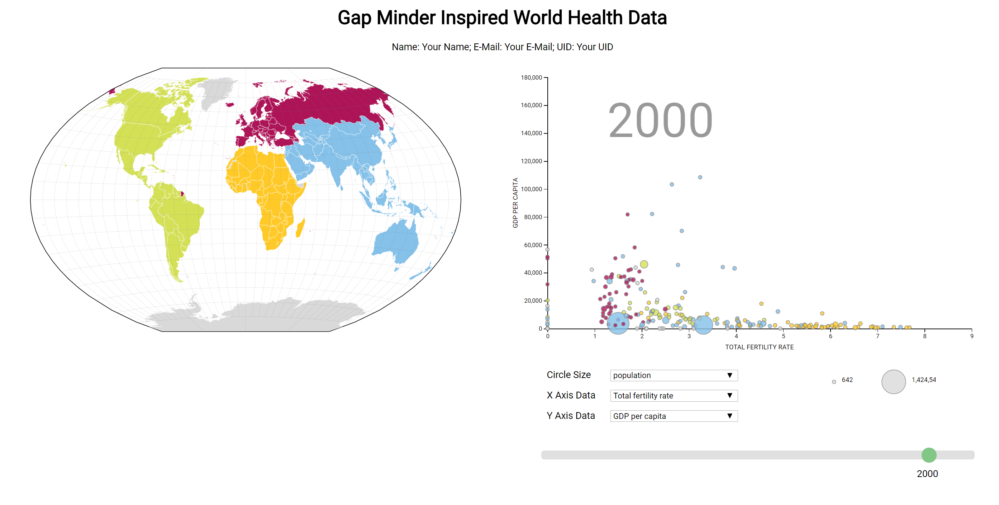
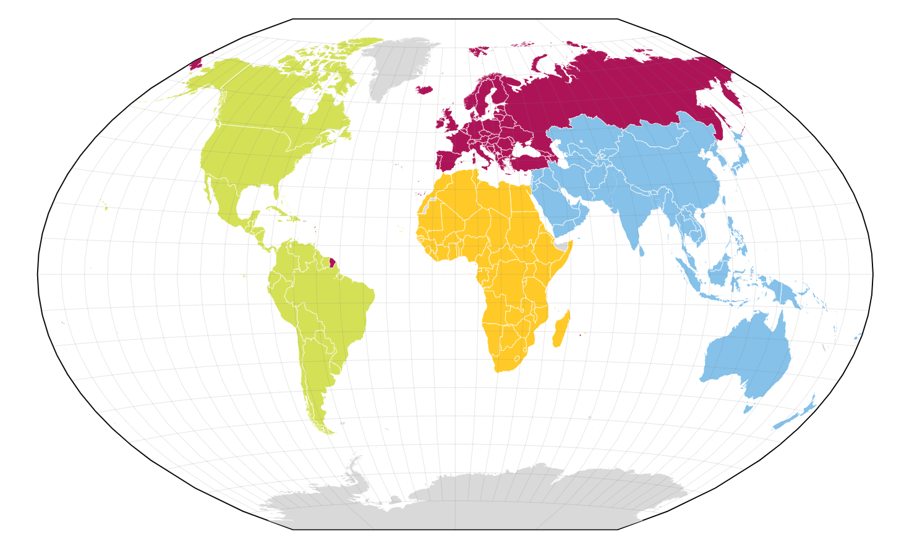
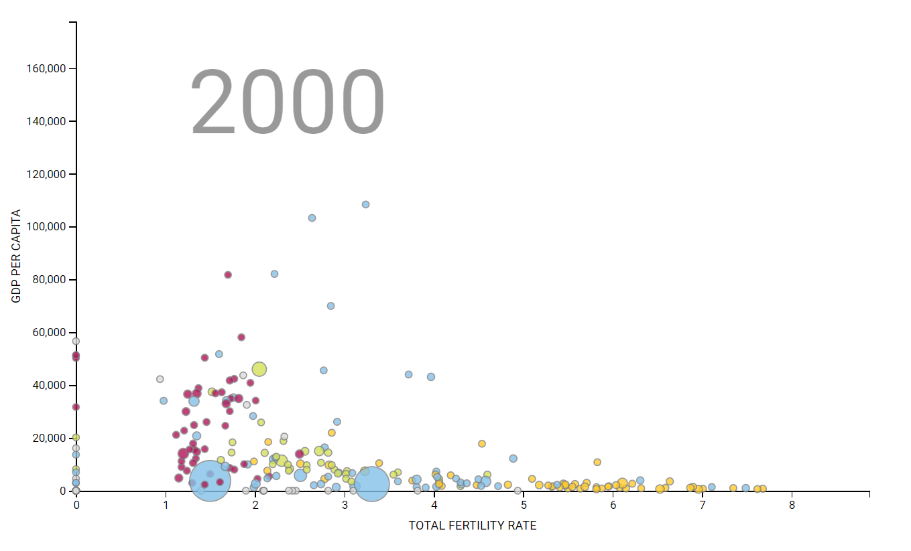
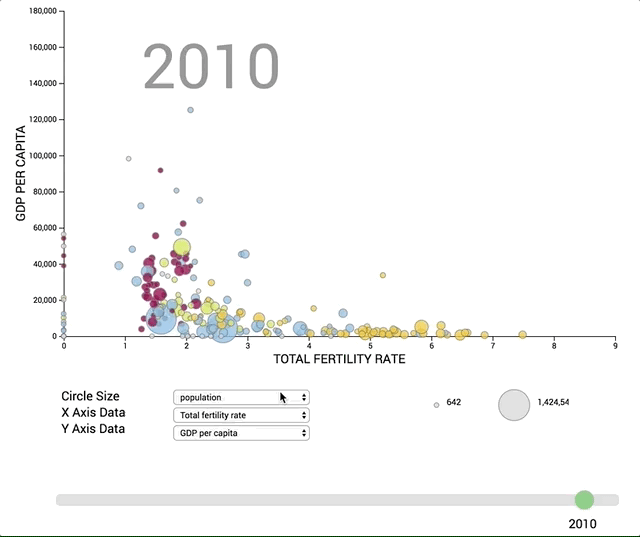
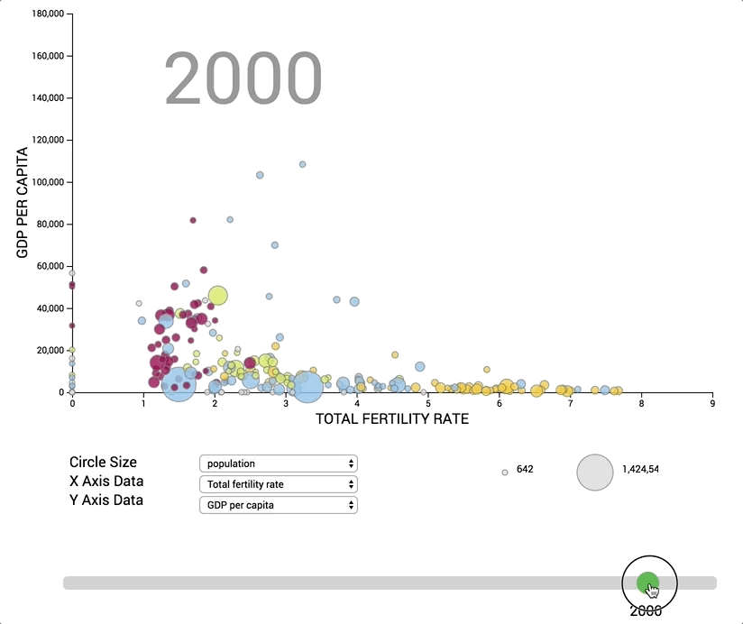
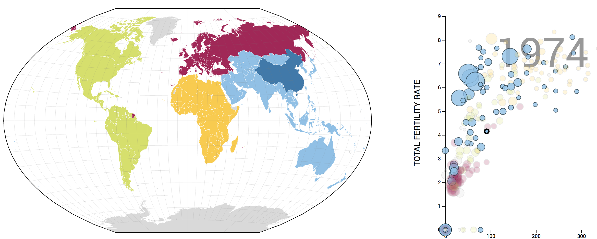
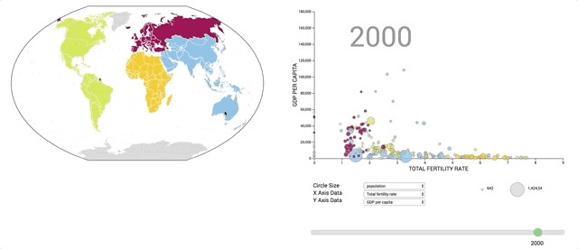

# CS-5630 / CS-6630 Homework 4
*Due: Tuesday, September 25, 11:59 pm.*

In this assignment you will build a visualization inspired by [Gapminder](https://www.gapminder.org/) to display world health data. The visualization is made up of three views: the map, the scatterplot, and the info box. 

The **map** provides geospatial context. Countries are color-coded by region and can be selected. 

The **scatterplot** is also color-coded by region, with selectable country bubbles. The data shown along the scatterplot axes are chosen from two drop-down menus. A third drop-down allows the user to choose the data that maps to the size of the bubbles. Below the drop-down menus is a range slider that changes the data to reflect a specified year. 

The **info box** shows basic information about the selected country.

When a country is selected in either the map or the scatterplot, the country is highlighted in both views and the info box will show data about that country. The final visualization should look similar to the figure below:



## Learning Goals

The learning goals for this homework are the following: 

 * Working with scales. 
 * Working with maps.
 * Dynamically updating charts.
 * Developing a visualization with multiple views that synchronizes selections.
  
## Project Structure
We have provided boilerplate code for you in `hw4.html` for the main structure of the layout. You will be working within the `.js` files that we have provided for the map, scatterplot, and info box views. 

As in the previous homeworks, add your Name, UID, and email address at the top of the homework.

The project file structure looks like this:

    hw4.html
    hw4.md
    style.css
    data/
        cmu5.csv
        gdppc.csv
        loife_expect.csv
        pop.csv
        tfr.csv
        world.json
    js/
        gap_plot.js
        info_box.js
        map.js        
        script.js


## Running the Project

To access the data files with javascript, you will need to be *serving* the homework directory, not just opening the HTML file in a browser. If your development environment doesn't already launch a server for you, you can start one with:

    $ cd path/to/hw4

    # For Python 2:
    $ python -m SimpleHTTPServer

    # For Python 3:
    $ python -m http.server

You can view the page at [http://localhost:8080](http://localhost:8080). Before you submit you homework, you will want to make sure your submission is a valid html5 file. You can validate Check that it is valid by uploading it to the [W3C HTML Validator](https://validator.w3.org/#validate_by_upload).

## The Data

Your map will use topoJSON data that is contained in the `world.json` file. The data is split into several csv files, one each for **child mortality**, **GDP per capita**, **life expectancy**, **fertility rate**, and **population** for countries. Each files contains data for every year from 1880 to 2020; take a look at the files to understand the structure. We are using data from the [GapMinder data repository](https://www.gapminder.org/data/). We provided the data loading for you, but you will have to pass the data to the corresponding view objects in `script.js`. 

Here is a sample of the population data: 

```
,geo,indicator_name,indicator,country,income,region,1800,1801,....,2019,2020
0,afg,population,pop,Afghanistan,Low income,asia,3280000,3280000,....,37209007,38054941
1,alb,population,pop,Albania,Upper middle income,europe,410445,411734,...,2938428,2942034
2,dza,population,pop,Algeria,Upper middle income,africa,2503218,2512195,....,42679018,43333255
```

Obviously, more years and the corresponding data follow where we put the  `....`.

You can access the data through the data object, which we create in `script.js` and pass to all constructors. The data object looks like this:

```javascript
{
    'population': pop,
    'gdp': gdp,
    'child-mortality': cmu,
    'life-expectancy': life,
    'fertility-rate': tfr 
}
```        

## Part 1. Map View



We are going to start by building a map. The first thing to do for this is to fill in `drawMap()`. We have provided you with the projection, including the scaling and translation necessary to center it in the designated map area. Note that we use the Winkel Tripel projection, which is [used by the National Geographic Society for world maps](https://www.nationalgeographic.org/media/selecting-map-projection/). Winkel tripel minimizes all distortions (area, angle, distance); you'll learn more about this in the maps lecture. 

We are going to be color-coding the countries by continent/region. We have provided the classes to color the countries in the css:
```
    .africa {
        fill: #FFCA28;
    }
   .asia {
        fill: #85C1E9;
    }
    .americas {
        fill: #D4E157;
    }
    .europe {
        fill: #AD1457;
    }
```

Refer to the [maps lecture](http://dataviscourse.net/tutorials/lectures/lecture-maps/) for details on how to implement the map. 

Also make sure that your map has the proper outline and graticule (the grid lines).

The map view uses the GEOjson data for the geometry. We use the `area` column from the population data (`pop.csv`) to identify which continent a country belongs to. After mapping, you can assign the region class to the country paths to color the map accordingly. 

## Part 2. Scatterplot

There are four parts to the scatterplot view: the actual plot, the drop-down menus that we can select health data for the axes and circles, the year slider, and the circle legend. We have provided the circle legend for you. The drop-down menus and range slider for the year are also provided, but you will have to set them up to pass the data and the year to redraw the plot. 


### 2.1 The Main Plot

The scatterplot shows the relationship between two chosen dimensions. You will be able to select the datasets for the x and y axis in the drop-down menus. The plot is drawn by calling `drawPlot()` which will create the initial plot structure. You do not need to pass any paramters in the `drawPlot()` function. 
We will update the plot with the data using `updatePlot()` function which takes four parameters: the year, x data key, y data key, and circle data key. We have provided a class `PlotData` (a helper class in `gap_plot.js`) that will be your data structure for the data passed to `updatePlot()`. You will choose the x, y and circle data by their corresponding key in the data object.

You will be calling `updatePlot()` in script.js with the x, y, and circle size indicators of your choice. The activeYear will be needed as well. The default for active year is set to `2000`. This needs to happen in `script.js` for your plot to show up on page load!

You will have data that will size the circles called circleSizeIndicator. We have provided a `circleSizer` function for you. You will use this when defining your 'r' attribute for your circles. It takes the circle data as a parameter. Note `circleSizer()` uses min and max values for the circle size data. You will need to declare min and max for the circle size variables in `updatePlot()`.

At the end of `updatePlot()` you will need to call the `drawDropDown()` and `drawLegend()` functions. See details below.



### 2.2 The Drop-down Menus
There are three drop down menus: the x and y data menus, and the circle data menu. Changing the menus redraws the plot from the currently selected data.The drop-drown structure is provided for you, but you will set up the `drawDropDown()` function to be called when a new data set is selected. (A god spot for this is at the bottom of the `updatePlot()` function. All three drop down menus will have all of the data categories (Child mortality, GDP per capita, Life expectancy, Fertility rate, and Population) to select from. We have set up `drawDropDown()` for you, but you will need to pass the x, y and circle size indicators that are passed to `updatePlot()` to it. 

This gif shows the desired behavior:



### 2.3 The Year Slider
The year slider will call the `updatePlot()` function on drag. When you move the slider, you should be able to watch the bubbles in the plot move and update. The year slider is provided for you, but you will have to set up the `updatePlot()` function call to pass the new year to draw the plot. Remember the years range from **1880 to 2020**. When the users changes the years slider, call the `updateYear(year)` callback to notify the relevant views.  

This gif shows the desired behavior: 



## Part 3. Syncrhonized Highlighting for the Map and Scatterplot

We now need to be able to select countries on the map and the scatterplot views. You will fill out the  `updateCountry(countryID)` for both the map and the plot view. Highlighting in the map corresponds to darkening the shade of the selected country. Highlighting in the scatterplot consists of three changes: 

1. darkening the shade of the selected country,
2. increasing the stroke width of the selected country, and 
3. graying-out all countries that are not on the same continent. 

Here is a figure that demonstrates the state after highlighting China.



This gif demonstrated the desired behavior:



See also [this video](figs/click.mp4) for a higher resolution version.


Along with the ability to highlight on select, we need to be able to clear a selection. This means we will have to fill the `clearHighlight()` function for each of the views and call them in the `script.js` file. When you click on an element or anywhere on the screen that is not a country element, the selection should clear. 


## Part 4. Country Info Panel
Now that we can select countries, we are going to pass the selected country information to an info box view. The info panel will update when a country element is selected from either the map or scatterplot views. When the year slider moves, the panel should also update along with the scatterplot. The info box should show all information about the country from all datasets. You will have to fill out the `updateTextDescription()` in the InfoBox class and call this within the `sript.js` file. For the changing of years in the data, you will need to fill out the `updateYear(year)` function in `script.js` and call it within the year slider to update the views.
`updateTextDescription()` takes `activeCountry` and `activeYear` and for each of the key-value pairs in this.data, creates an `infoBoxData` object. `InfoBoxData` that takes the 4 paramters: 
1. country (the country name from the data)
2. region (the region accociated with the selected country)
3. indicator_name (the name of the data category, such as 'Life Expectancy')
4. value (the atual number value for the data indicator at the specified year)


## Grading

35% Map View Implementation – map is drawn, countries are colored by region, graticule is drawn  
35% Scatterplot Implementation – scatterplot is drawn, country bubbles are colored by region, plot updates by change in x, y, and circle data menus, year slider updates plot.  
10% Info Box Implementation – Info box shows a selected country, color coded by region. Country name, region, and all of the stats are present.  
20% Highlighting and Selection Implementation  – Both map and scatterplot countries select on click. Selection clears when you click on the screen but not on country. Year slider updates stats.

