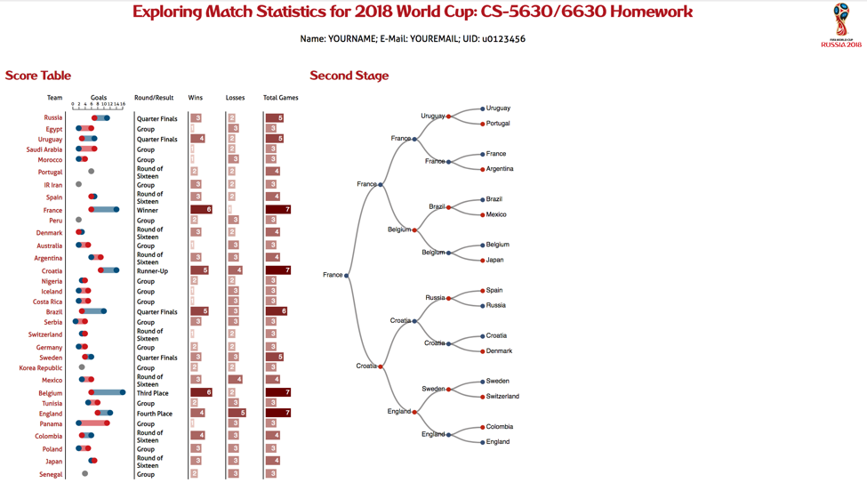
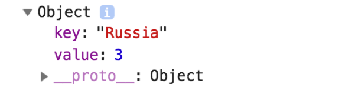
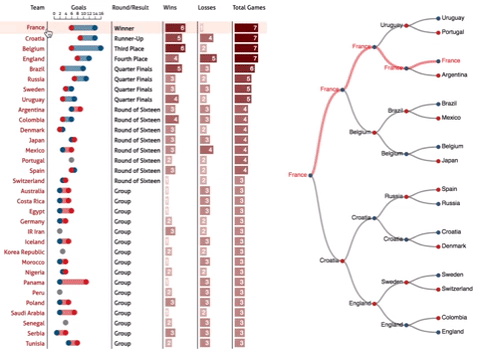

# CS-5630 / CS-6630 Homework 5
*Due: Friday, October 12, 11:59 pm.* 

In this assignment you will explore game statistics from the last Fifa World Cup in 2018. To this end, you will create an interactive table and a tree layout that are linked to each other. 

We've retrieved the data from [FIFA's website](http://www.fifa.com/fifa-tournaments/statistics-and-records/worldcup/).

## Visualization Design

In the **table** we are going to compare the following attributes for each participating country: goals made and conceded, number of games lost, won, and played, and the result achieved (i.e., how far a team got before exiting) in the tournament. 
We are also going to visualize results for specific matches by allowing the user to expand and collapse all matches for a selected country (6630 only). 

In addition, we'll visualize the bracket for the second stage (the knockout phase) of the tournament in a **tree**. The tree and table are linked so that hovering over a team in the table highlights all the tree nodes and links for that team. Hovering over a specific match highlights only that game. 

Your final visualization should look roughly as follows: 



## Learning Goals

The learning goals for this homework are the following: 

 * Deriving a dataset, i.e., making a data transformation, by aggregating using `d3.nest()` (Hacker Version - extra credit only). 
 * Creating custom visualizations with several components (dots and rectangles for goals).
 * Working with tree layouts.
 * Selecting elements based on their data fields and not on their class or id.
 * Reinforce the logical association of data to elements and how they are passed down from parent to child element.  

## Implementation

We have provided boilerplate code that you should use to develop your solution. Note that you're free to diverge from our suggested solution, as long as you (a) stick with D3 and (b) can justify your choices.

As in previous homeworks, add your name, your e-mail address, and your UID to the HTML elements at the top. Also make sure your submission is a valid HTML5 file. Check that it is valid by uploading it to the [W3C HTML Validator](https://validator.w3.org/#validate_by_upload).

Other than adding your name, etc., you should not need to edit the html file in this assignment (though you are free to optimize positioning, etc.)

Your project structure looks like this:

    hw5/
        hw5.html
        styles.css
        assets/
        data/
        	fifa-matches-2018.csv # use this for the hacker version
        	fifa-matches-2018.json # use this for the normal version
        	fifa-tree-2018.csv
        figs/
        	# figures / videos used in the description
        	# irrelevant for the project
        js/
            script.js # initialization, you'll probably only touch this for the hacker version
            table.js # the table implementation
            tree.js # the tree implementation
            
        
        	   
Remember, to be able to access the data files with javascript, you will need to be *serving* the homework directory, not just opening the HTML file in a browser.

## Loading the Data

There are two versions to this homework: a HACKER VERSION and a regular version. 

In the **regular version**, we load the complete data structure for the table from the `fifa-matches-2018.json` file and store it in the `teamData` variable when you call the constructor of the table. Notice that when building the tree each row in treeData will need to have a unique id. Because the data does not have that field, we created it when reading in the data and stored it in the `id` field. We recommend that even if you plan on doing the hacker version, that you start with the front-end first and hence use the JSON.

In the **HACKER VERSION**, we load the data from a csv file `fifa-matches-2018.csv` and you will have to create the data structure yourself, and store it in `teamData` variable. 

The tree data is loaded from the file `fifa-tree-2018.csv` in the provided code. We read the data in and pass it as an argument to `createTree(treeData);` - this is already implemented in your stub. As the **regular version**, you also need to create a unique `id` field for each row in treeData.   

If you're not planning on doing the extra credit hacker version, you can move on to Part II. We suggest, however, that you read through it and take a close look at the data structure of the JSON show below. 

## Part I: Data Aggregation (HACKER ONLY)

*Note: There are many ways to create the derived dataset. We suggest a way using D3 tools below. You can implement this however you want, as long as it's sensible. Your output JSON must be identical, though.* 

The dataset lists games and their results, but we (also) want to visualize how a team did in the whole tournament, so we have to aggregate. The first step is to change the format of your input data so as to aggregate the parameters as a function of country. Nesting allows elements in an array to be grouped into a hierarchical structure; where you can group by a given parameter in your data. Use the [`d3.nest()`](https://github.com/d3/d3-collection#nests) operator to create a nested object as a function of the `Team` attribute. 
  
Because we want to aggregate (i.e. sum) the values of goals, wins, losses, and games, for all matches played by a given country, we will want to use the rollup function available within `d3.nest()`. 
This rollup function will collapse the elements in each leaf node using a summary function. Here is an example for summing all the values in the "Wins" column: 

```javascript
teamData = d3.nest()
    .key(d =>{
        return d.Team;
    })
    .rollup( leaves =>{
        return d3.sum(leaves,function(l){return l.Wins}); 
    })
    .entries(allGames);
```
  
The above code will return an array of objects that each have a key and a value field where the key is the country name and the value is the sum of the 'Wins' attribute of each leaf (game) as seen below:
  
  
  
Notice how the object returned by nest does not retain any references to the data that is nested (i.e, the leaves/games). However, because we will be implementing expanding/collapsing rows to show the specific game information, we want to store data about the games in a nested structure, in addition to the aggregated (sum) values.

   
This means our rollup function will be more elaborate: we will construct a value object for each team that contains the sum of each attribute as well as an array of games that has a similar data structure to the teams, so that we can easily render both in the rows. 
  
Your output of `d3.nest()` should look like this JSON (with more games).
  
```JSON
[{
   "key": "Brazil",
   "value": {
       "Goals Made": 8,
       "Goals Conceded": 3,
       "Delta Goals": 5,
       "Wins": 4,
       "Losses": 1,
       "Result": {"label": "Quarter Finals", "ranking": 2},
       "TotalGames": 5,
       "type": "aggregate",
       "games": [{
           "key": "Switzerland",
           "value": {
               "Delta Goals": "",
               "Goals Conceded": "1",
               "Goals Made": "1",
               "Losses": "",
               "Opponent": "Brazil",
               "Result": {"label": "Group", "ranking": 0},
               "Wins": "",
               "type": "game",
   			}
		}]
	}
}]    
```
  
The team object now has one field for each of the attributes for a given country, plus a list of games that also have the relevant data set. One special case is the `Result` attribute that is an object with a label and an associated rank (we'll use the rank for sorting later) for the highest round that team reached. You will want to implement this logic inside the rollup function when creating the `Result` attribute. 
  
Note that aside from the aggregated attributes, we have one more field for the top-level teams object: the `type`, a string that indicates whether this data object is an aggregate. This field will become important later in the homework.   

## Part II: Scales, Axis, and List  

Now that we have a data array, we can use it to set the domains for the the scales provided at the top of `table.js`. When creating the domain for `goalScale`, think carefully about what attribute you want to use to set the domain values. We will be using this scale to visualize goals made, conceded, and the difference between the two.

### Add X axis to Goals Column header
    
The next step is creating an x axis underneath the goals column header. Notice that we provided a table cell with an id of goalHeader that is already in the right location. 
 
### Create list to populate table. 

Recall from earlier how our table will be composed of two types of rows. Aggregate rows that contain summary values for all games, and game specific rows that contain information for a given match. In order to facilitate the process of populating this table, we will be keeping an updated list of all data elements we want to display in the table in the global variable `tableElements`. As a first step, just copy  the `teamData` list over to the `tableElements`. 

We are now ready to populate the table with aggregate rows! 


## Part III: Update Table  

The next step is to implement the `updateTable()` function, which will render the table, based on the data stored in `tableElements`. Later we will implement the ability to add, delete, or re-sort rows based on user interaction. 

*Note that we've made a design decision to use an HTML Table, instead of manually building a table just with SVG group elements. The advantage of that approach is that we don't have to worry about the position of cells much, so it's overall easier to do. The disadvantage is that we can't do fancy sorting transitions.*

Recall from the overview figure at the beginning of this document that the table has three different types of visualizations: goals, results, and win/loss/game counts. 

While our final table will have rows for games and teams, we first will create only a table for teams. 

We will be populating the table in three steps:  

 1. Add bar charts for the number of wins, losses and total games. 
 2. Add our custom *goals charts* for the number of goals made and conceded. 
 3. Display the Round/Results as a text element. 
 
Before populating the chart, we must first create the row and cell elements. We will do this in a very similar fashion to what we have done before when creating data driven SVG elements. By selecting the table element and using enter and append to create `<tr>` and later `<td>` elements. 

A few important pointers: 

*  Because every data element will be associated to one row, we want to append the data from our `tableElements` list to the `<tr>` elements. 
*  When creating our `<td>` (cell) elements, data is passed down from the parent element (`<tr>`). 

Take the following syntax:  

```javascript
let td = tr.selectAll("td").data((d) => { /* create data array here */ });
```
Notice how we are not passing in new data to the `<td>` elements, but only a function that will manipulate the data being passed down from `tr`, which is the parent element. And we also need column informations to pass in so that we won't miss column data. This will generate as many `<td>` elements as there are data elements in the array returned by your function(d){}. 

Add a `console.log()` call to see what the data being passed down looks like. This will make it easier for you to decide what to return as the data you want bound to your `<td>` elements. 

At this point we are only handling aggregate values but because we will be eventually handling game specific data objects, we want to keep track of what kind of data we are passing into these `<td>` elements. This means that the anonymous function defined as a parameter to your `data()` operator (as shown above) should return an object with three fields: `type`, `vis`, and `value`. The first will indicate if this is an `aggregate` or `game` row, the second will serve as a tag for what kind of vis we will use for that data (`bar`, `goals`, or `text` for example), and the third will contain the actual value we want to visualize in that cell.

Now that you have created your row and cell elements, let's make some SVG plots!

### Bar Charts 
Select all `<td>` elements in the Wins, Losses, and Total Games columns. You can do this by selecting all `<td>`'s and [filtering](https://github.com/d3/d3-selection#selection_filter) by the vis attribute in your data element. Here's an example, applied to a selection `td`:

```javascript
td.filter((d) => {
	return d.vis == 'goals'
})
```

After that, `td` will only contain the elements that have a field `vis` that matches to the string `goals`.

In each selected element, create a new `<svg>` element and add a `<rect>` element. Use the `cellWidth` and `cellHeight` attributes to initialize the width and height of the SVG, and the scales and the data for the width of the rectangle. These bars should be colored by the absolute value of the associated property and labeled with the numeric value of that attribute as well as seen in the example below. 

### Goals Charts

The goals charts visualize a summary of a teams performance: the goals made and the goals conceded are encoded using circles' position, while the goal difference is encoded by a bar. The marks are red for the conceded goals and blue for the made goals. Similarly, a positive goal difference is highlighted by a blue bar, while a negative goal difference is shown in red. Gray markers are used for ties.

In addition, display the goals made and goals conceded in a tooltip when the mouse hovers over the each goals chart.

You should be able to create the goals chart using the same basic approach as for the bars.

### Other Columns

Populate the 'Team' column and the Round/Results column with text injected straight into the `<td>`s. 

### Up and Running! 

Once you got this far, you have the main view of your visualization up and running! It should look something like this: 


## Part IV: Adding Games (CS 6630 Students Only)

Next, we'll make it possible to dynamically add the games that a team played. Click on any aggregate row to expand the table and show an extra row for each match played by that country. 

When we show the games played by a team, right underneath the team and before the next team's row, we use a slightly different visual encoding for the goals scored, conceded and the goal difference, to set them apart from the aggregated per-team goals charts visualization. We use the same scale, but we're encoding something different, so we style it differently. We use a "ring" instead of a circle, and a narrow line/rectangle to encode the difference. The first column shows the opponent with an 'x', as in 'xArgentina'. Also, in the Round/Result column, we show the round of the particular game (group phase, round of sixteen, etc.) The other columns are not used for game rows. Here is an example for Germany:


You will have to make these distinctions in your `updateTable()` function based on whether an element of the `tableElements` list has the `type: aggregate` field or not. 

Implement a callback so that when a user clicks on a country name, the game rows are added. For this, we will implement the `updateList(i)` function, that will insert and remove rows from our tableElements list. 

The fundamental idea is for the `updateList()` function, to add the games of a team to top level of the `tableElements` list, so that the `tableElements` list consists of a mix of teams and games. As teams and games have very similar attributes, we can treat them largely the same, with the exception of the styling details discussed above.

Notice that when you  call `updateList()` from the click event, you can pass in the 'i' attribute that will indicate the index of the row (i.e, the element in the list) that was clicked, which you can use to identify the team or the game that was clicked.

There are three cases you have to deal with: 

1. If a team was clicked, and the next element in the list is also a team, add its games to the list following the team's entry. 
2. If a game was clicked, do nothing. 
3. If a team was clicked, and the next element in the list is a game, it means that the team's games are already expanded and we want to remove them! Remove the games associated with the clicked game. 

Once the list is updated, we can call `updateTable()` and watch the magic happen!

### Collapse all game specific rows

Implement the `collapseList()` function such that it goes through all our tableElements list and removes any objects that are not aggregates.

## Part V: Sorting

Here you will want to implement a callback function so that when the user clicks on the column headers it will 
sort all the rows as a function of that column attributes. For example, clicking on 'Wins' sorts the row so that
the country with the most wins is at the top, and the one with the least is at the bottom. Clicking on a header twice should sort the column in the opposite direction. 

As mentioned earlier you have two types of data rows, one that is the aggregate value for all
matches played by a country, and the other is for a specific game. When implementing your sorting logic, collapse all match specific rows (calling the recently implemented `collapseList()`) so that only aggregate rows are sorted and displayed. *That's not a great solution for a real system, but keeps things simpler*

*We've included CSS to change your cursor to an arrow icon to indicate that a table column is sortable. In a real system, you'd probably also want to show a glyph to indicate that the column is sortable. [Here](https://datatables.net/examples/basic_init/table_sorting.html) is a particularly well designed example of using glyphs for that purpose.*  


## Part VI: Create Tree

Now we will create a tree layout for all the games in the second stage. 

We'l start off by implementing `createTree(treeData)` that takes as an argument the data read in from `fifa-tree.csv`. 

`createTree(treeData)` should use the `d3.tree()` layout to generate the tree. Note that before populating the tree with the `treeData` input argument you will need to use the `d3.stratify()` operator to create the parent/node relationship between the games. The syntax for `d3.stratify()` is as follows:


```javascript
let root = d3.stratify()
    .id(d => { return d.name; })
    .parentId(d => { return d.parent; })
    (data);
```

Where `.id` is unique identifier for each node and `.parentId` indicates what field contains the parent Node to that element. 

*This syntax might be strange to you. `d3.stratify()` returns a function, and the function that stratify returns is later called using the `(data)` expression. Hence, the function returned by `stratify()` is then run with data as a parameter. The function that is returned, however, also has parameters - `id` and `parentid` that we can set. In other words, `d3.stratify()` is a generator for a function to stratify your dataset.* 

Once you have created the tree, color the nodes for winning teams in red and losing teams in blue as in the figure below. 


## Part VII: Link Tree and Table

And last but not least link the table and the tree so that when the user hovers over any aggregate row all the games that country played in (and connecting links) are highlighted in the tree. 
When a user hovers over a game row, only that game should highlight in the tree. Implement this logic in `updateTree()` and `clearTree()`. The former should highlight the appropriate nodes/links and the latter should remove all highlighting from the tree. 



## DONE! 

Your final solution should behave something [like this](https://youtu.be/XptHn4kV5xw)

## Grading

The rubrics on the assignment for **CS 6630** are:

10%: Part I (HACKER VERSION EXTRA CREDIT): Data is loaded from the CSV file. JSON file isn't used.   
5%: Part II: Table setup is done properly.  
35%: Part III: Table is properly populated.   
20%: Part IV: Games are added dynamically 
10%: Part V: Table is properly sorted when user click on column headers.   
20%: Part VI: Tree is properly rendered.  
10%: Part VII: Link between table and tree works correctly for both aggregate and game rows.      

The rubrics on the assignment for **CS 5630** are:

10%: Part I (HACKER VERSION EXTRA CREDIT): Data is loaded from the CSV file. JSON file isn't used.   
10%: Part II: Table setup is done properly.  
40%: Part III: Table is properly populated.   
15%: Part V: Table is properly sorted when user click on column headers.   
25%: Part VI: Tree is properly rendered.  
10%: Part VII: Link between table and tree works correctly for both aggregate and game rows.  
