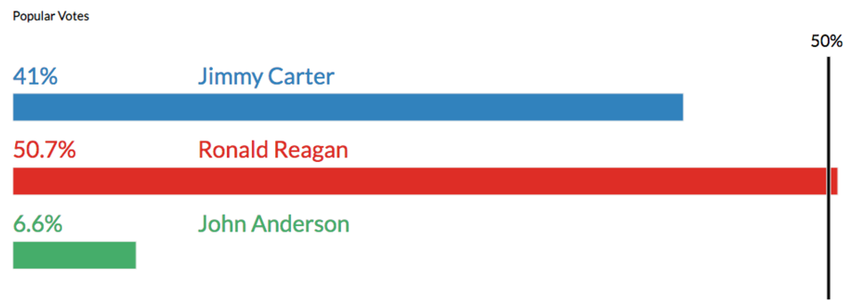

# CS-5630 / CS-6630 Homework 6
*Due: Friday, October 26, 11:59 pm.* 

In this assignment you will use your existing knowledge of creating basic visualizations from the previous assignments to create custom visualizations. You will also learn to organize your code and to work with brushes. These visualizations are linked to each other and display statistics from US Presidential Election data dating back to 1940.

## Visualization design

We are going to visualize the election outcomes and the contribution of different states over multiple years. You will be able to see the outcomes for the Democratic and Republican parties, as well as notable independent candidates (note: independents are rare, as they have to win a state to show up in our visualization). You will be using five charts:

A **year chart** visualizes the election outcomes over the various years and allows you to select a specific year to explore via the remaining views.

An **electoral vote chart** shows the distribution of the electoral votes and corresponding winner.

A **vote percentage chart** displays the percentage of votes won by each party (or independent candidate).

A **tile chart** visualizes the electoral vote data, but with geospatial context. In addition, a tool tip will display the distribution of votes within a state. 

A **trend chart** that shows the selected states and/or *[Extra Credit]* visualizes the shifts in outcome for those states over time.

The year chart will be your pivot for interaction as it controls the information being displayed by the electoral vote chart, the vote percentage chart and the tile chart. Also, brushing on your electoral chart and/or *[Extra Credit]* year chart should filter the information being displayed by the trend chart.

Your final visualization should look roughly like this (tooltip and brush are displayed to show interaction): 


## Implementation

We have provided boilerplate code that you should use to develop your solution. In this assignment you will be using an  object oriented approach to work with multiple visualizations. Each visualization will be implemented in a separate javascript file, and each visualization will be contained within an different object. We have provided you with the scaffold for these objects. You should use a similar approach for your final projects!  The ``script.js`` file takes care of creating instances of the objects and calls the functions necessary to invoke the visualizations.

As in previous homeworks, add your name, your e-mail address, and your UID to the HTML elements at the top. Also make sure your submission is a valid HTML5 file. Check that it is valid by uploading it to the [W3C HTML Validator](https://validator.w3.org/#validate_by_upload).

Other than adding your name, etc., you shouldn't need to edit hw6.html in this assignment (though you are free to optimize positioning, etc.)

Your project structure should looks like this:

    hw6/
        hw6.html
            public/
                css/ # there are styles here that you can use!
                   style.css 
                js/ # you'll be doing most of your work here
                   script.js
                   yearChart.js
                   electoralVoteChart.js
                   votePercentageChart.js
                   tileChart.js
                   shiftChart.js
        data/
          yearwiseWinner.csv
          Year_Timeline_1940.csv
          Year_Timeline_1944.csv 
	       # more csv files for different years here
        figs/
        	# figures / videos used in the description
        	# irrelevant for the project
        
        	        	   
Remember, to be able to access the data files with javascript, you will need to be *serving* the hw6 directory, not just opening the HTML file in a browser. If your development environment doesn't already launch a server for you, you can start one with:

    cd path/to/hw6
    # python 2
    python -m SimpleHTTPServer
    # python 3
    python -m http.server

Then you can view the page at [http://localhost:8080](http://localhost:8080)

## About the Data

In the data folder, you will find the ``yearwiseWinner.csv`` file that has information about the election years. For each year, it contains data on which party won and the margin (i.e., the percentage difference in the popular vote between the Republican and Democratic parties). 

There are also ``.csv`` files corresponding to every election year, for example `Year_Timeline_1940.csv`. In these files, each row corresponds to a state, and contains data such as the state abbreviation, state name, who won the state (D: Democrats, R: Republicans, I: Independent candidates), vote percentage, vote counts, etc. Note that the file contains more data than you are required to use. Feel free to play with representing this data if you like!

Columns associated with each party are prefixed with `D_`, `R_`, or `I_`, respectively. For instance, the number of votes won by Democrats in a given state is listed in the column `D_Votes`.

In addition, the party that won the state's electoral votes will display in the column `State_Winner`. If it's empty, that means the state split the electoral votes across multiple parties. This only happens twice in the data, for Nebraska in 2008 and for Maine in 2016. You will be required to handle this condition in both the electoral votes and the tiles charts.

We have loaded the initial `yearwiseWinner.csv`` file, but you will need to take care of data loading and parsing the yearly files. 

## Part I: Year Chart

The year chart visualizes the year and the winning party of all presidential elections since 1940.

The chart is initialized in the `constructor()` method, which already contains all the code to initialize the svg element for the chart. This is a good reference for how to initialize the rest of your charts. 

You should implement your chart in the ``update`` method of the ``yearChart.js`` file. Within the `YearChart` object, you have access to the data through the variable `this.electionWinners`. 

To create this chart, append circle elements to the SVG created in the ``constructor`` method.
Each year is represented as a circle that is assigned a color according to the party that has won the election that year. To get the colors right, assign class name to each circle according to the winning party (`.republican`, `.democrat` or `.independent`). These classes are defined in the `style.css` file for you. You can also use the provided `chooseClass` method to assign the appropriate class. This method is provided in each of the visualization class files. Below the circles for each year, you should also include a text element that displays the year value. You can assign the class `.yearText` to style this element.

The year chart should be interactive. When hovering over a year, you should add the `.highlighted` class to the circle (and remove it from all others). Similarly on click (and/or brush for extra credit), the `.selected` class should be added. 

On selection (click), you should also trigger an event that populates the electoral votes chart, vote percentage chart and tile chart with the appropriate data. Based on the year that is selected, you should load the appropriate ``year_timeline_XXX.csv`` file, populate the data, and make the relevant calls to the update methods of the other visualizations. We have included a global color scale  `colorScale` based on the margin of victory for Republican and Democrat parties, to be used consistently across all your visualizations. You will be sending both the data and the color scale as parameters to the update methods of appropriate charts.

When you're done with this part, your year chart should look something like this: 


## Part II: Electoral Votes Chart

Initialize the chart in the `electoralVoteChart.js` file in the ``constructor`` method, modeled after the `constructor` method in ``yearChart.js``. 

In Part I you should have implemented an event so that the ``update`` method for this chart is triggered with a selection in the year chart and it receives the data corresponding to the year selected. 

In the ``update`` method, create a stacked bar chart for each party where each bar represents single state. These bar charts will encode a catagorical value (political party) in the *y* dimension and have constant *height*. An appropriate scale should be used to update the *x* attribute and *width* according to the number of electoral votes cast for a given political party by a given state (`R_EV`, `D_EV`, or `I_EV`) The bars should also be colored and ordered by margin of victory between the Republican and Democratic parties (`RD_Difference`). Postive values indicate that the Republican party won, negative values indicate that the Democrats won. When an Independent candidate wins, this attribute is ill-defined. 

To style your bars, you can use the predefined class `.electoralVotes`. Sort your bars such that, the state with the highest democratic victory should be dark-blue and be positioned at the far left; the state with the highest republican victory should be dark-red and be positioned at the far right (note: these colors come from the provided color scale). Place Independent-won states in their own bar, and use a uniform green color to represent them.

As you can see in the provided screenshot, there are additional details that should to be displayed. Include a marker on the bar chart that highlights the *270* votes *needed to win*. You should also display the total electoral votes cast for each party. These elements should roughly be placed according to the layout in the screenshot below. 

The text elements can be styled using `.electoralVoteText` class that is provided in the `style.css` file. Whenever any detail specific to certain party to be displayed, you can also make use of the approriate political party class to color your elements.

<!-- Hovering over the bars should display the state, electoral votes and also name of the nominee, total number of votes won and respective percentages for all the parties in a tool tip. You are provided with a method that renders the *HTML* content based on the details you intend to display. All you need to do is to populate the data that you send to this method and call this tool tip wherever necessary. The similar code is provided across most of your files to reduce the overhead of creating it from scratch. -->

Your electoral vote chart should look something like:


## Part III: Vote Percentage Chart

This chart will show the distribution of the popular vote. You will need to initialize the chart.

The chart is updated similar to the electoral vote chart. The bar chart encodes the vote percentage for each party. Each bar represents one party and is sized according to the percentage of votes won by that party. These values are available in the `D_PopularPercentage`, `R_PopularPercentage` and `I_PopularPercentage` columns in the data. This isn't elegant and stores the data redundantly, but that's the way the data source is. You can use the `.votePercentage` and policial party classes to style your bars. You should also add a line demarcating `50%`of the popular votes. 

Hovering over the bars should display the name of the nominee, total number of votes won and respective percentages for all parties in a tool tip. You are provided with a method that renders the *HTML* content based on the details you intend to display. You will need to do to populate the data that you send to this method and call this tool tip as necessary.

As seen in the screenshot below, you should display the percentage of votes won by a party, as well as the name of the candidate, on top of its corresponding bar. You can use the `.votesPercentageText` to style your text elements.

Your vote percentage chart should look something like:



## Part IV: Tile Chart

Next, you'll implement a cartogram that communicates the distribution of electoral votes and margin of victory (`RD_Difference`) in a geospatial context. In the cartogram, each state will be represented by a square of equal size; the squares are placed so that they correspond to their position on a map. By using equal-sized squares, we ensure that all state results are equally readable.
 
You will need to initialize the chart first.

To lay out the tiles, assume that you are given a matrix. where each cell corresponds to a tile. Some tiles are filled in (the states), others are not (i.e., remain white). To position a tile, you require its row and column information within this matrix. Within your data, there are attributes named `row` and `column` for each state. Taken together, these row and column values define the layout. There are 8 rows and 12 columns in this matrix. Using this information, you should be able to find the values of height and width that each tile can take. Once you have these values, you can position the tile using the row and column information to drive the *x* and *y* attribute values. You can use the provided `.tile` class to style your tiles. If a state splits it's electoral votes across multiple parties, you will need to split the tile area by the ratio of electoral votes assigned to a given party.

Color-code the tiles by margin of victory using the global `colorScale`, and display the abbreviation of the state and the number of its electoral votes. For states with split electoral votes, you should color each respective area by multiplying `RD_Difference` by `[D,R,I]_EV` / `Total_EV` (and don't forget to that signs matter for out color scale!). The text elements in this chart can be styled using the `.tilestext` class.

This view should also contain a legend for out color scale. We have provided most of the code for a legend that works with a quantile scale. You will need to place it appropriately and call the element so that it is displayed.

On hover, the tiles in your cartogram should display a tool tip containing the state name, the total number of electoral votes for the state, the name of each party's nominee, and number and percatange of votes won by each party with respect to that given state. The tool-tip from the reference solution is shown in the screenshot below.


## Part V: Making the Electoral Vote Chart Interactive with Brushing

To visualize how states have shifted over time, we want to be able to select or *brush* the states we're interested in. We're going to have you select the states the electoral vote chart. 

In D3, a brush is an interactive area where clicking and dragging of the mouse is interpreted as a selection of a range or *extent*. Thus selection is then used to make changes to the visualization. The extent of a bush selection is illustrated in the following image. Note that the area where you can click and drag to initiate a brush is shown in blue, while the visible representation of the brush is shown in gray. See the [D3 Brush API](https://github.com/d3/d3-brush) for more details.

<p align="center">

</p>

You can create a brush with the code below. Similar to a d3 scale, a brush essentially converts the range of a selection in the visualization space into a range of the data space. You should use the same scale infomration for your brushes that you are using to drawing your axes and/or visualization content. The `.on()` event handler simply calls the `brushed` function when a brush `end` event occurs.

```javascript
var brush = d3.brush().extent([<minX>,<minY>],[<maxX>,<maxY>]).on("end", brushed);
```
The values that you give in the extent will be the screen space bounds of the area you want users to be able to select.

You can add the brush to a visulaiztion as follows: 

```javascript
svg.append("g").attr("class", "brush").call(brush);
```

The `brush` function is called on a group element (`<g>`), creating new DOM elements. In order to understand what is going on, you may want to take a look at the brush itself in the DOM. 

**You will need to implement 1D brushes for each party's stacked bar**. These brushes should update a list of selected states as the the brushes move. You should implementing a basic chart (via `trendChart.js`) that displays the names of the selected states. This will allow you to verifu that your brush works. The ``update`` method of the trendChart object should be triggered by updates to the brush selection.  Your ``brushed`` method(s) can access the extent of the selection though the ``d3.event.selection`` attribute. Once you have this value, you can then check for the bars that fall within the selected range and pass the selected data to the update method of the 

## Part VI: Voter Shift Visualization Design

On paper, you should design two different visualizations that show how all states (and/or a selected subset of states) have shifted politically over time. The goal is to see both global trends and be able to trace the trends for individual states. 

Justify your design choices via a writeup (i.e., in a text file). Submit a PDF of your designs in the root folder under the name `design.pdf`, and your justifcations as `notes.txt` or `notes.pdf`. If you would like to integrate both in the same `.pdf` that is also acceptable.

## Extra Credit 1: Brushing Years

Implement a brush on the year chart to select a range of election years. Use the data extracted from the brush to update your Voter Shift Visualization. If you're not doing the extra credit 2 part, simply update your simple trendChart to also display the selected years. If you *are* doing extra credit 2, your trendChart visualization should react to the selection of years.


## Extra Credit 2: Implement Trend Chart

Implement your best trend chart design to visualize the shifts in outcomes for the selected states over time. You can decide how many elections you want to include, if you're not doing Extra Credit 1. Excellent implementations should work for many elections (5-10, more with scrolling) and should listen to the year brush. The data contains yearly shifts in the `shift` and `shiftDirection` dataset columns. A shift value to the right indicates voters shift towards being more Republican and the shift value to the left indicates the state's shift towards being more Democrat.

## DONE! 

Your final solution should behave something [like this](https://youtu.be/VpuXaajgJq4).  Note that we're not including an example trend chart, as we don't want to prime you with a design.

## Grading

The rubrics on the assignment are:

**15%: Part I:** Year chart displays correctly. The selection of a year loads the appropriate ``.csv`` file and the update method of all the necessary charts are triggered.

**25%: Part II:** Electoral Vote chart displays and updates correctly when selecting a year, including the size and the colors of the bars representing the states. 

**10%: Part III:** Vote Percentage chart displays and updates correctly when selecting a year.

**30%: Part IV:** Tile chart displays and updates correctly when selecting a year. The layout of tiles is done correctly. Tool tip is implemented.

**10%: Part V:** Brushing on Electoral Vote chart correctly finds the elements being selected and makes a call to the update function of shift chart. The trend chart displays the states brushed.

**10%: Part VI:** Two well-justified visualization designs are handed in.

**5%: Extra Credit 1:** Brush is implemented for the year chart and the trend chart also updates according to this brush selection.

**15%: Extra Credit 2:** A trend chart that encodes the required information and responds to the change in brush selection. Note that the full 15% will only be given for exceptional implementations based on exceptional designs that can also adjust the number of years to show, e.g., based on the brush of years.
  
